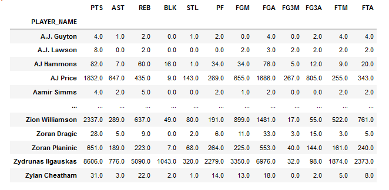

<div id="top"></div>
<!--
*** Thanks for checking out the Best-README-Template. If you have a suggestion
*** that would make this better, please fork the repo and create a pull request
*** or simply open an issue with the tag "enhancement".
*** Don't forget to give the project a star!
*** Thanks again! Now go create something AMAZING! :D
-->


<!-- PROJECT SHIELDS -->
<!--
*** I'm using markdown "reference style" links for readability.
*** Reference links are enclosed in brackets [ ] instead of parentheses ( ).
*** See the bottom of this document for the declaration of the reference variables
*** for contributors-url, forks-url, etc. This is an optional, concise syntax you may use.
*** https://www.markdownguide.org/basic-syntax/#reference-style-links
-->
[![Contributors][contributors-shield]][contributors-url]
[![Forks][forks-shield]][forks-url]
[![Stargazers][stars-shield]][stars-url]
[![Issues][issues-shield]][issues-url]
[![LinkedIn][linkedin-shield]][linkedin-url]


<!-- PROJECT LOGO -->
<br />
<div align="center">
  <a href="https://github.com/MartinPadillaSchekaiban/NBA">
    
  </a>

<h3 align="center">NBA Analysis</h3>

  <p align="center">
    This project was made using Python to analyze LeBron James impact on the NBA.
    <br />
    <a href="https://github.com/MartinPadillaSchekaiban/NBA"><strong>Explore the docs »</strong></a>
    <br />
    <br />
    <a href="https://github.com/MartinPadillaSchekaiban/NBA">Report Bug</a>
    ·
    <a href="https://github.com/MartinPadillaSchekaiban/NBA">Request Feature</a>
  </p>
</div>


<!-- TABLE OF CONTENTS -->
<details>
  <summary>Table of Contents</summary>
  <ol>
    <li>
      <a href="#about-the-project">About The Project</a>
      <ul>
        <li><a href="#built-with">Built With</a></li>
      </ul>
    </li>
    <li>
      <a href="#getting-started">Getting Started</a>
      <ul>
        <li><a href="#prerequisites">Prerequisites</a></li>
        <li><a href="#data-sources">Data Sources</a></li>
      </ul>
    </li>
    <li><a href="#usage">Usage</a></li>
    <li><a href="#roadmap">Roadmap</a></li>
    <!--<li><a href="#contributing">Contributing</a></li>-->
    <!--<li><a href="#license">License</a></li>-->
    <li><a href="#contact">Contact</a></li>
    <!--<li><a href="#acknowledgments">Acknowledgments</a></li>-->
  </ol>
</details>


<!-- ABOUT THE PROJECT -->
## About The Project


Through the you will find about LeBron James performance on the NBA though 2013 season to 2020

<p align="right">(<a href="#top">back to top</a>)</p>


### Built With

* [Python](https://www.python.org)

<p align="right">(<a href="#top">back to top</a>)</p>


<!-- GETTING STARTED -->
## Getting Started


### Prerequisites

These are the python libraries you´ll need to run the ipynb file.
* Libraries
  ```sh
  pip install numpy
  pip install seaborn 
  pip install matplotlib
  pip install pandas
   ```

<p align="right">(<a href="#top">back to top</a>)</p>

### Data Sources

The data source of this project where downloaded from [Kaggle](https://www.kaggle.com/nathanlauga/nba-games)
* These are the csv files used inside the project

  * **games.csv :** all games from 2004 season to last update with the date, teams and some details like number of points, etc.
  * **games_details.csv :** details of games dataset, all statistics of players for a given game
  * **players.csv :** players details (name)
  * **ranking.csv :** ranking of NBA given a day (split into west and east on CONFERENCE column
  * **teams.csv :** all teams of NBA

<p align="right">(<a href="#top">back to top</a>)</p>


<!-- USAGE EXAMPLES -->
## Usage

You can use this data to analyze:
* How a player has performed through time
* Predict a game result based on the team´s individuals
<p align="right">(<a href="#top">back to top</a>)</p>


<!-- ROADMAP -->
## Roadmap

To do ALL of the following analysis first I did the import via pd.read_csv commands and joined them as I needed to, you can check that inside the [.ipynb file](NBA_analysis.ipynb) with the step by step solution.

### 1. Looking at the data

<p align ="center">

</p>


### 2. LeBrons PPG each season

<p align ="center">

</p>

* After 18 seasons Lebron finally appeares to be slowing down on PPG for the last 4 seasons

### 3. Lebrons Assist Per Game each season

<p align ="center">

</p>

* 2019 season Lebron avg 9.1 assist per game
* Doesnt seem to be slowing down on playmaking

### 4. Lebrons field goal percentage each season
<p align ="center">

</p>

* Pretty consistent throughout his career averaging over 45%

### 5. LeBron stats vs other players since 2013
<p align ="center">

</p>
<p align ="center">

</p>

* Lebron marked as yellow circle, almost on top of every graph
* More then 40,000 points made on field goals, around 10,000 more than the next guy. With alot more attemps though
* 4th on 3 pointers made and 3th on attemps. Not what Lebron is really known for but still on top of the graphs!
* Top on assists and steals

<!-- CONTACT -->
## Contact

Martin Padilla - [@LinkedIn](https://www.linkedin.com/in/martinschekaiban/)

Project Link: [https://github.com/MartinPadillaSchekaiban/NBA](https://github.com/MartinPadillaSchekaiban/NBA)

<p align="right">(<a href="#top">back to top</a>)</p>


<!-- MARKDOWN LINKS & IMAGES -->
<!-- https://www.markdownguide.org/basic-syntax/#reference-style-links -->
[contributors-shield]: https://img.shields.io/github/contributors/camiloms10/NBA_project.svg?style=for-the-badge
[contributors-url]: https://github.com/camiloms10/NBA_project/graphs/contributors
[forks-shield]: https://img.shields.io/github/forks/camiloms10/NBA_project.svg?style=for-the-badge
[forks-url]: https://github.com/camiloms10/NBA_project/network/members
[stars-shield]: https://img.shields.io/github/stars/camiloms10/NBA_project.svg?style=for-the-badge
[stars-url]: https://github.com/camiloms10/NBA_project/stargazers
[issues-shield]: https://img.shields.io/github/issues/camiloms10/NBA_project.svg?style=for-the-badge
[issues-url]: https://github.com/camiloms10/NBA_project/issues
[linkedin-shield]: https://img.shields.io/badge/-LinkedIn-black.svg?style=for-the-badge&logo=linkedin&colorB=555
[linkedin-url]: https://www.linkedin.com/in/camilo-manzur-4b7137a8/
[product-screenshot]: images/screenshot.png
